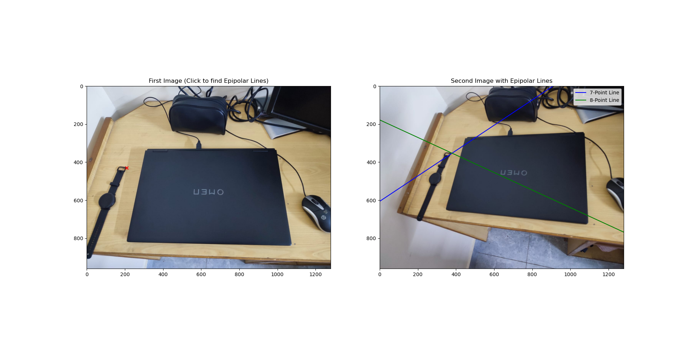

# Epipolar Geometry Visualization using 7-Point and 8-Point Algorithms

This project allows users to load two images, select a point in the first image, and visualize the corresponding epipolar lines in the second image. The epipolar lines are computed using both the **7-point** and **8-point** fundamental matrix estimation algorithms via OpenCV.

## 🧠 Features

- Select two corresponding images.
- Compute **Fundamental Matrix** using:
  - 7-point algorithm (exactly 7 correspondences)
  - 8-point algorithm (exactly 8 correspondences)
- Visualize:
  - A clicked point on the first image
  - Corresponding **epipolar lines** on the second image for both methods
- Interactive GUI using `Tkinter` and visual display using `matplotlib`.

## 🔧 How It Works

1. You select two images.
2. The program extracts SIFT features and finds good matches using FLANN + Lowe's ratio test.
3. It computes two fundamental matrices:
   - One using the top 7 matches (7-point)
   - One using the top 8 matches (8-point)
4. You click a point on the first image.
5. The corresponding epipolar lines are drawn in the second image:
   - **Blue**: 7-point result
   - **Green**: 8-point result

## 📸 Example

Below is a sample output after selecting an image pair and clicking a point in the first image:




## 🖥️ Requirements

- Python 3
- OpenCV (`opencv-python`)
- NumPy
- Matplotlib
- Tkinter (comes with most Python installations)

Install dependencies with:

```bash
pip install opencv-python numpy matplotlib
```

## 🚀 Run the Code

```bash
python epipolar_gui.py
```
## 📝 Notes
The 7-point algorithm may return multiple fundamental matrices. This project uses the first one.

Ensure that the selected image pair has sufficient overlapping features for accurate epipolar geometry.

